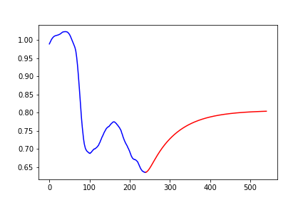

# metricPlutus
Metric Plutus is an econometric analysis on how COVID-19 hits different cities and its long term impact. This analysis primarily utilizes time series analysis forecasting and prediction based on a sequential neural network architecture.

*This is an award winning submission of the Duke 2020 Datathon*

https://dukeml.org/datathon/index.html

## Abstract
We present a methodology for studying the economic impact of COVID-19 on cities under a consumer spending and business revenue perspective. We find in one year, places like Chicago will be most severely affected by COVID-19, followed by Los Angeles, while Charlotte is the least affected one among the cities we investigate. In general, we concluded that cities with lots of small industries and decreased population mobility are most severely affected.

## Some Schematics
Charlotte High Income Employment            |  Chicago Low Income Employment
:-------------------------:|:-------------------------:
  |  

According to our prediction, in one year, Chicago will be most severely affected by COVID-19, Los Angeles follows, while Charlotte is the least affected one. This makes economic sense, as Chicago has the greatest number of small businesses, and many of their lockdowns would lead to high unemployment rate. Moreover, Chicago imposes strict social distancing rules, and social mobility would therefore be impaired as people are forced to stay at homes. Both of these are crucial covariates for predicting consumer spending and business revenue. Los Angeles would also be somewhat affected because it has lots of small businesses, though not as many as Chicago, and social distancing rules. Significant decrease in import and export would also lead to its economic depression. Charlotte would righteously be the least affected one by the similar line of reasoning. In two or five years, there would be much higher uncertainty in prediction, but we can reasonably believe that cities like Chicago with lots of small businesses and strict social distancing rules would still be the most impacted ones, since compared to other industries or agriculture, small businesses are much harder to recover from an economic trough. Closure of deprecation of many small businesses would be irreversible, and its influence can extend to a much wider span of time.

